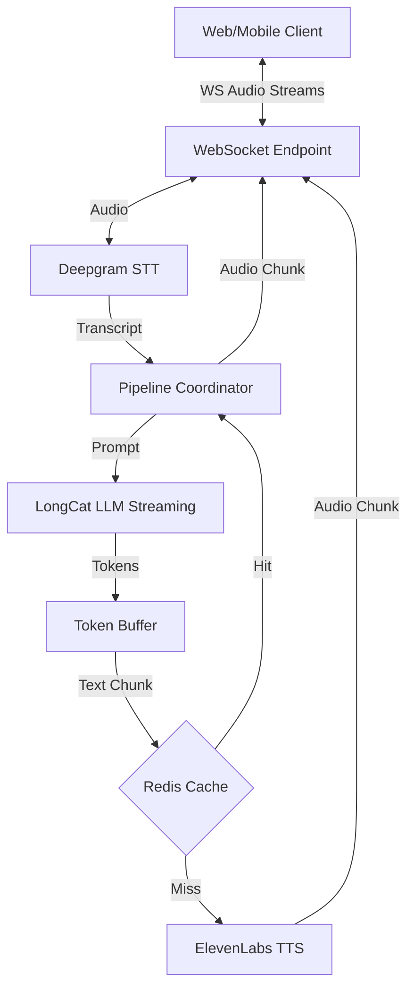

# Real-Time Arabic Voice AI Assistant

A low-latency, production-ready Arabic voice assistant built with FastAPI, WebSockets, and best-in-class AI services.

## 🚀 Key Features

- **Real-Time Bidirectional Streaming**: Powered by WebSockets.
- **Low Latency STT**: Integrated with **Deepgram Nova-2** for Arabic.
- **Streaming LLM**: Using **LongCat API** (OpenAI-compatible).
- **Premium Streaming TTS**: Powered by **ElevenLabs Multilingual v2**.
- **Interactive Interrupt Handling**: Stops current audio immediately when user starts speaking again.
- **Performance Optimized**: Token buffering and Redis caching for audio chunks.
- **Production Ready**: Structured JSON logging and Dockerized setup.

## 🏗 Architecture



## 🛠 Setup Instructions

### 1. Environment Variables
Create a `.env` file in the root directory:
```env
LONGCAT_API_KEY=your_longcat_key
DEEPGRAM_API_KEY=your_deepgram_key
ELEVENLABS_API_KEY=your_elevenlabs_key
REDIS_HOST=localhost
REDIS_PORT=6379
```

### 2. Run with Docker (Recommended)
```bash
docker-compose up --build
```

### 3. Run Locally (Development)
```bash
# Install Redis
# Create virtual env
pip install -r requirements.txt
python -m backend.main
```

## 🔌 API Usage

### WebSocket Endpoint
- **URL**: `ws://localhost:8000/ws/voice-stream`
- **Protocol**: 
  - Send: Binary PCM audio chunks.
  - Receive: Binary MP3 audio chunks.

### Test API (MVP Phase)
- **POST** `/api/voice/generate`
- **Body**: `{"text": "مرحباً كيف حالك؟"}`

## ⚡ Performance Targets
- STT (Deepgram): ~300ms
- LLM (LongCat): First token ~400ms
- TTS (ElevenLabs): First audio chunk ~300ms
- **Total Perceived Latency: ~1s**
